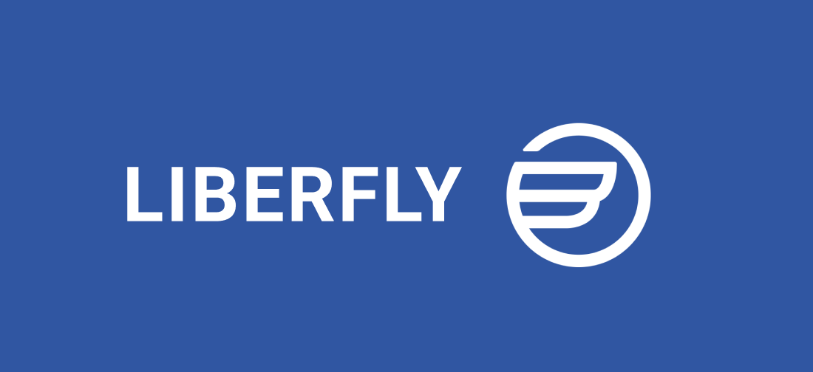
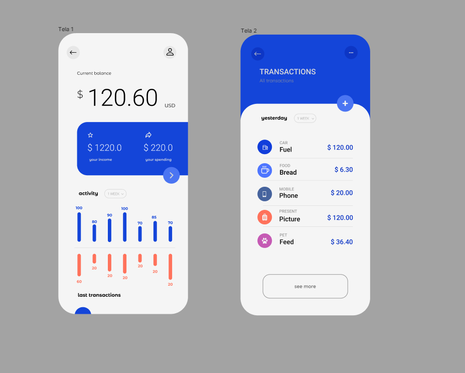

# Desafio Frontend Liberfly 

01 - Recriação da interface no Figma: 
    objetivo: 

[Link para o figma](https://www.figma.com/file/IdivzWRiYyk4Mf7ZmiCyX0/Liberfly-Challenge?node-id=0%3A1)

### Resultado:
  

 
    

# Ferramentas

<a href="reactnative.dev"> React Native</a>
<a href="styled-components.com"> Styled Components</a>
<a href="expo.io"> Expo </a>